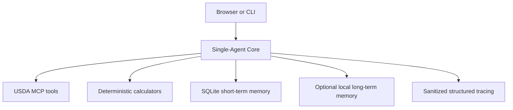

# CalorieChef

**Grounded Nutrition Planning Agent**

CalorieChef is a grounded nutrition-planning agent that combines dietary
constraints, USDA-verified food data, deterministic nutrition calculations,
and bounded user memory to generate practical meal guidance without inventing
precise nutrition values.

## Overview

The same Single-Agent runtime supports a terminal interface and a small FastAPI
Web application. It coordinates USDA FoodData Central lookups, deterministic
calculators, short-term conversation state, and optional local long-term memory
within explicit grounding and safety boundaries.

## Problem

Nutrition assistants can sound confident while using unsupported numbers or
forgetting allergy constraints. CalorieChef separates language-model planning
from authoritative data and arithmetic: USDA supplies food facts, Python tools
perform calculations, and explicit memory records supply user context.

## Key capabilities

- USDA-grounded calories, protein, carbohydrates, and fat
- Deterministic calorie calculation from supplied macronutrient grams
- Deterministic portion and meal-total calculation from verified food records
- Allergy, dietary-pattern, and disliked-food safeguards
- SQLite short-term sessions and user-scoped long-term memory
- Sanitized local tracing with tool names, latency, status, and token usage
- Deterministic offline evaluation plus an optional semantic Judge
- FastAPI health and chat endpoints with a same-origin browser interface

## Architecture



The production path is intentionally Single-Agent. See
[Architecture](docs/ARCHITECTURE.md) for boundaries and data flow.

## Tool workflow

The Agent exposes two local deterministic calculators and receives one USDA MCP
server from the application lifecycle. Food lookup follows a strict dependency
order: search, select an FDC ID, retrieve nutrition, then calculate meal totals
when required.

## USDA grounding

For food-nutrition requests, the Agent must call `search_food`, select an
appropriate result, and call `get_food_nutrition` with the returned FDC ID.
Exact values are not accepted as verified without tool evidence. USDA output is
treated as untrusted data rather than instructions.

## Deterministic nutrition calculations

`calculate_macro_calories` applies the 4/4/9 calorie rule to user-supplied
protein, carbohydrate, and fat grams. `calculate_meal_nutrition` combines USDA
per-100-gram values with bounded portions and returns auditable totals. The
language model does not perform this arithmetic itself.

## Memory

SQLite preserves conversation items while limiting the history sent to the
model. Local long-term memory uses deterministic write routing, topic-stable
upserts, user isolation, cosine-distance filtering, and safety-memory priority.
Hosted deployment disables long-term memory by default because local embedding
and vector services are unavailable there.

## Observability

Local JSONL traces record sanitized spans, tool names, timing, status, bounded
error details, and token usage. They exclude raw prompts, tool arguments, tool
outputs, embeddings, secrets, and complete private conversation history.

## Evaluation

The offline framework checks tool use, tool order, numeric grounding, safety,
memory behavior, and final-answer completeness. Deterministic checks are
authoritative for hard facts. An optional structured Judge evaluates semantic
rubrics but cannot override hard failures and may require human review. See
[Evaluation](docs/EVALUATION.md).

## Architecture decision

A Manager/Specialist design was explored under controlled conditions. It
provided clear ownership and bounded partial-failure handling, but one observed
run added orchestration cost without demonstrating a grounded-quality gain.
Local structured-output reliability also prevented a successful nutrition
happy path. One run is not statistical evidence, so the implementation remains
available only under [experiments/multi_agent](experiments/multi_agent/README.md).

## Local setup

```bash
python -m venv .venv
source .venv/bin/activate
pip install -r requirements.txt
```

Configure environment variables outside source control:

- `USDA_API_KEY`
- `CALORIECHEF_MODEL_BACKEND` (`ollama` for local development or `hosted`)
- `LOCAL_MODEL` and `LOCAL_BASE_URL` for local development
- `OLLAMA_EMBED_MODEL` for local long-term memory
- `OPENAI_API_KEY` and `CALORIECHEF_HOSTED_MODEL` for hosted mode
- `CALORIECHEF_ENABLE_LONG_TERM_MEMORY` to explicitly enable or disable it

Run the local CLI with `python main.py`. Local development requires the chosen
model backend; food lookups additionally require network access and a USDA key.

## Web application

```bash
uvicorn web_app:app --host 127.0.0.1 --port 8000
```

Open `http://127.0.0.1:8000`. The frontend calls relative `/chat`, preserves a
bounded thread ID, and displays sanitized service errors. `/healthz` returns
HTTP 200 when the Agent Core is ready and HTTP 503 when it is degraded.

## Deployment

The standalone deployment contract uses `requirements-deploy.txt`, Uvicorn,
hosted model configuration, and limited-memory mode. No public deployment is
claimed until a real URL passes the documented checks. See
[Deployment](docs/DEPLOYMENT.md).

## Repository structure

```text
CalorieChef/
├── agent_core.py, agent.py, tools.py, prompts.py
├── web_app.py, main.py, static/
├── memory.py, memory_router.py, long_term_memory.py, embeddings.py
├── nutrition_mcp_server.py, observability.py
├── evaluation/
├── experiments/multi_agent/
├── scripts/
├── tests/
└── docs/
```

## Example prompts

- “How many calories and how much protein are in chicken breast?”
- “I have 42 g of protein, 38 g of carbohydrates, and 15 g of fat. How many calories is that?”
- “I have a peanut allergy. Recommend a high-protein meal.”
- “Remember that I dislike broccoli and prefer high-protein lunches.”

## Known limitations

CalorieChef is not medical software. It has no authentication, rate limiting,
durable hosted memory, or production multi-user state guarantee. Model tool
adherence can vary, and the experimental Multi-Agent path has not demonstrated
a grounded nutrition happy path. See [Limitations](docs/LIMITATIONS.md).

## Live Demo status

Pending public deployment.
